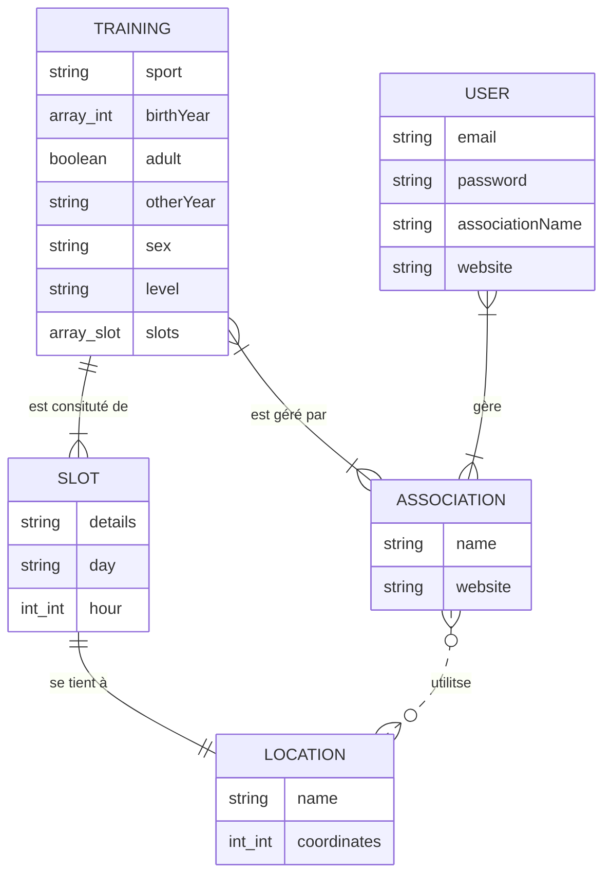

# TODO

- [x] sport multi select
- [x] filtre conservé au changement de page
- [ ] implémenter la recherche (petit écran)
- [x] régler le problème des salles
- [x] formulaire de création de cours
- [ ] formulaire de création de lieu

# DB Graph

