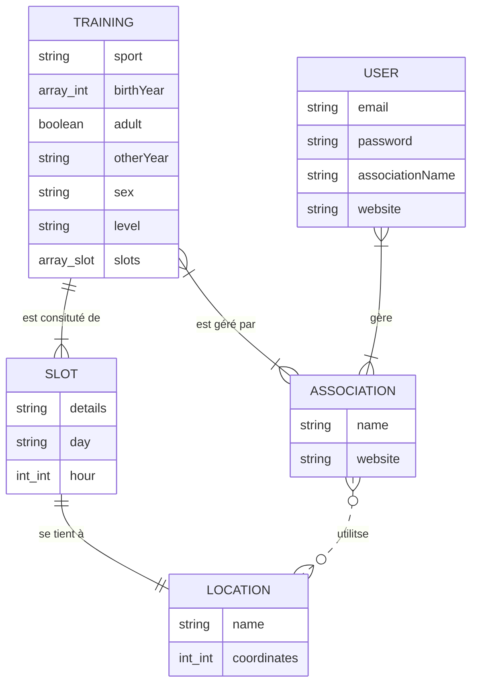

# TODO

- [x] les icones des liens doivent se colorer
- [ ] décimales des nombres des input range
- [x] précision des latitutdes / longitudes
- [ ] afficher un lieu par défaut

# DB Graph

## Indexes

2 indexes:

- collection sports:
  - slots.location.coordinates: 2dsphere
- collection locations:
  - coordinates: 2dsphere

## Schema

